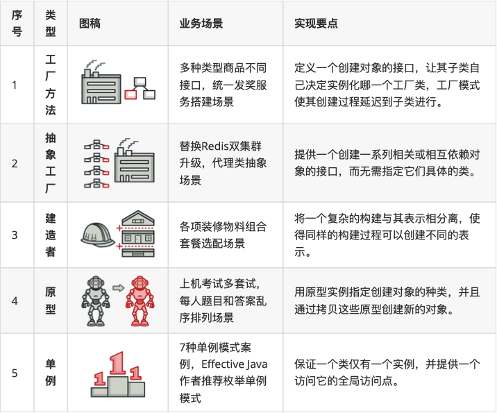
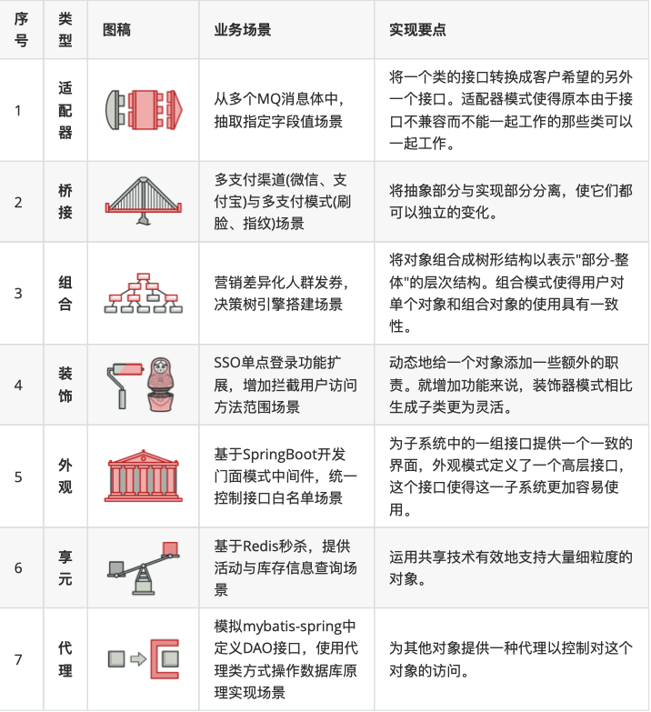
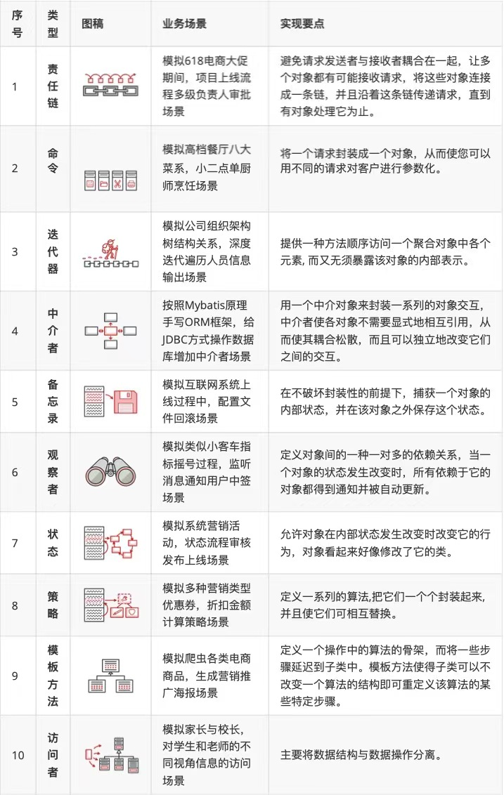

参考资料：
 - [《重学Java设计模式》——小傅哥](https://github.com/fuzhengwei/CodeGuide/blob/master/docs/md/develop/design-pattern/2020-05-20-%E9%87%8D%E5%AD%A6Java%E8%AE%BE%E8%AE%A1%E6%A8%A1%E5%BC%8F%E3%80%8A%E5%AE%9E%E6%88%98%E5%B7%A5%E5%8E%82%E6%96%B9%E6%B3%95%E6%A8%A1%E5%BC%8F%E3%80%8B.md)
 - [REFACTORING.GURU - https://refactoringguru.cn](https://refactoringguru.cn/design-patterns)
 - [菜⻦鸟设计模式 - RUNOOB.COM](https://www.runoob.com/design-pattern/design-pattern-tutorial.html)
 
设计模式遵循六⼤原则：（SOLLID）
 - 单⼀职责（Single Responsibility Principle）：⼀个类和⽅法只做⼀件事
 - 开闭原则（Open Close Principle）：抽象架构，扩展实现
 - ⾥⽒替换（Liskov Substitution Principle）：多态，⼦类可扩展⽗类
 - 迪⽶特原则（Law of Demeter）：最少知道，降低耦合
 - 接⼝隔离（InterfaceSegregation Principles）：最小化， 减少依赖从而降低变更的风险。
 - 依赖倒置（Dependence Inversion Principle）：细节依赖抽象，下层依赖上层
 
## 1. 创建型模式
这类模式提供创建对象的机制， 能够提升已有代码的灵活性和可复⽤性。

## 2. 结构型模式
这类模式介绍如何将对象和类组装成较⼤的结构， 并同时保持结构的灵活和⾼效。

## 3. ⾏为模式

