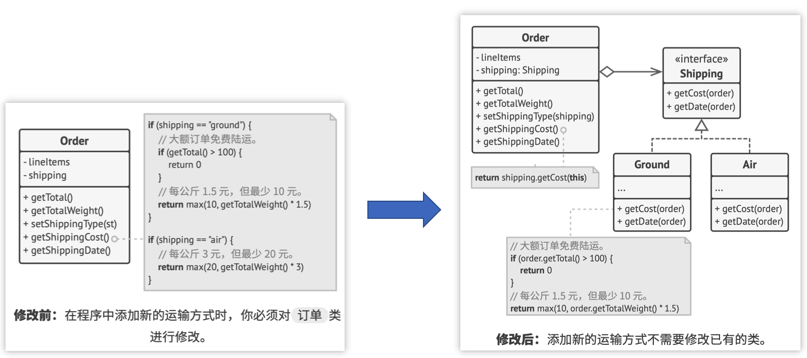
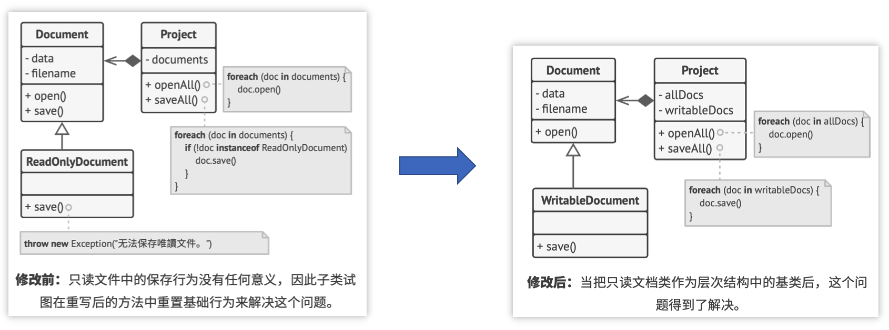
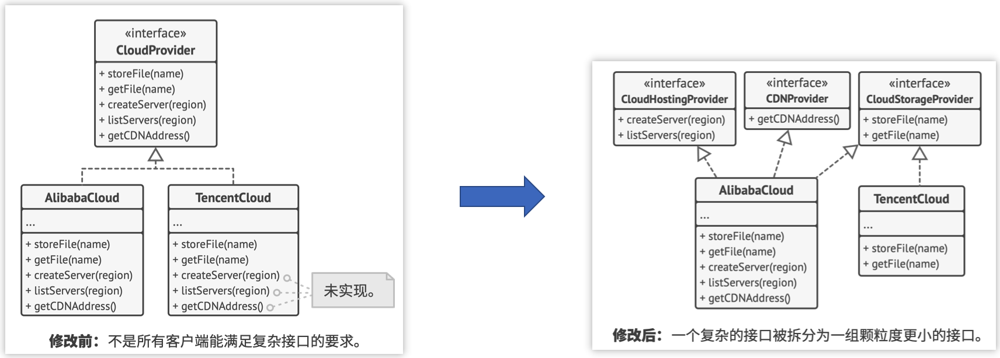
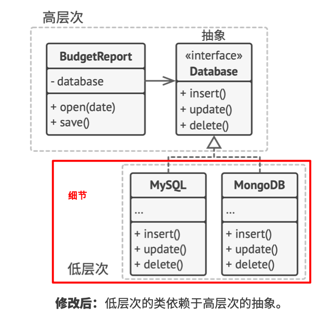

参考资料：
 - [《深入设计模式》 - https://refactoringguru.cn](https://refactoringguru.cn/design-patterns/catalog)
 - [设计模式|菜鸟教程 - RUNOOB.COM](https://www.runoob.com/design-pattern/design-pattern-tutorial.html)

## 面向对象程序设计简介
### 类和对象
### 抽象
抽象是一种反映真实世界对象或现象中特定内容的模型， 它 能高精度地反映所有与特定内容相关的详细信息， 同时忽略 其他内容。  
例如，商品域的商品模型 关心的是商品的类型、上下架状态、审核状态、商品详情等，供应链域的商品模型 关心的则是商品的规格（大小）、成本、产地等信息
### 封装
封装是指一个对象对其他对象隐藏其部分状态和行为， 而仅 向程序其他部分暴露有限的接口的能力。  
启动一辆车的发动机， 你只需转动钥匙或按下按钮 即可， 无需打开引擎盖手动接线、转动曲轴和气缸并启动发 动机的动力循环。 这些细节都隐藏在引擎盖下， 你只会看到 一些简单的接口：启动开关、方向盘和一些踏板。这些接口是对象的公有部分， 能够同其 他对象进行交互。
### 继承
继承最主要的好处 是代码复用。  
子类仅能对一个父类进行扩展，父类如果实现了某个接口， 那么其所有子类都 必须实现该接口。
### 多态
多态性依赖于继承。从一个父类派生出多个子类，可以使子类之间有不同的行为，这种行为称之为多态。更直白的说，就是子类重写父类的方法，使子类具有不同的方法实现。  
例如 AbstractParamValidHandler，有很多子类：SpotParamValidHandler(现货商品入参校验)，PresaleParamValidHandle(预售商品入参校验)...

## 设计模式遵循六⼤原则：（SOLID）+ 迪米特法则
 - 单⼀职责（Single Responsibility Principle）：⼀个类和⽅法只做⼀件事。（抽一个xxHelper出来）
 - 开闭原则（Open Close Principle）：扩展开放，修改封闭（抽象架构，扩展实现）
   
 - ⾥⽒替换（Liskov Substitution Principle）：多态，⼦类可扩展⽗类
   
 - 接⼝隔离（InterfaceSegregation Principles）：最小化， 减少依赖从而降低变更的风险。
   
 - 依赖倒置（Dependence Inversion Principle）：细节依赖抽象，下层依赖上层（低层次的查MySQL、查MongoDB 依赖 高层次的抽象出来的 查询repository）
   
 - 迪⽶特法则（Law of Demeter）：最少知道，降低耦合

## 1. 创建型模式
这类模式提供创建对象的机制， 能够提升已有代码的灵活性和可复⽤性。

| 序号 | 类型     | 图稿                                                         | 业务场景                                            | 实现要点                                                     |
| ---- | -------- | ------------------------------------------------------------ | --------------------------------------------------- | ------------------------------------------------------------ |
| 1    | 工厂方法 |  | 多种类型商品不同 接⼝，统⼀发奖服 务搭建场景        | 定义⼀个创建对象的接⼝，让其⼦类⾃⼰决定实例化哪⼀个⼯⼚类，⼯⼚模式 使其创建过程延迟到⼦类进⾏。 |
| 2    | 抽象工厂 |  | 替换Redis双集群 升级，代理类抽象 场景               | 提供⼀个创建⼀系列相关或相互依赖对象的接⼝，⽽⽆需指定它们具体的类。 |
| 3    | 建造者   |   | 各项装修物料组合 套餐选配场景                       | 将⼀个复杂的构建与其表示相分离，使 得同样的构建过程可以创建不同的表 示。 |
| 4    | 原型     |     | 上机考试多套试， 每⼈题⽬和答案乱 序排列场景        | ⽤原型实例指定创建对象的种类，并且 通过拷⻉这些原型创建新的对象。 |
| 5    | 单例     |     | 7种单例模式案例，Effective Java 作者推荐枚举单例模式 | 保证⼀个类仅有⼀个实例，并提供⼀个访问它的全局访问点。       |

## 2. 结构型模式
这类模式介绍如何将对象和类组装成较⼤的结构， 并同时保持结构的灵活和⾼效。

| 序号 | 类型   | 图稿                                                        | 业务场景                                                     | 实现要点                                                     |
| ---- | ------ | ----------------------------------------------------------- | ------------------------------------------------------------ | ------------------------------------------------------------ |
| 1    | 适配器 |  | 从多个MQ消息体中， 抽取指定字段值场景                        | 将⼀个类的接⼝转换成客户希望的另外⼀个接⼝。适配器模式使得原本由于接 ⼝不兼容⽽不能⼀起⼯作的那些类可以 ⼀起⼯作。 |
| 2    | 桥接   |    | 多⽀付渠道(微信、⽀付宝)与多⽀付模式(刷脸、指纹)场景         | 将抽象部分与实现部分分离，使它们都可以独⽴的变化。           |
| 3    | 组合   |    | 营销差异化⼈群发券，决策树引擎搭建场景                       | 将对象组合成树形结构以表示"部分-整体"的层次结构。组合模式使得⽤户对单个对象和组合对象的使⽤具有⼀致 性。 |
| 4    | 装饰   |  | SSO单点登录功能扩展，增加拦截⽤户访问⽅法范围场景            | 动态地给⼀个对象添加⼀些额外的职责。就增加功能来说，装饰器模式相⽐⽣成⼦类更为灵活。 |
| 5    | 外观   |    | 基于SpringBoot开发门⾯模式中间件，统⼀控制接⼝⽩名单场景     | 为⼦系统中的⼀组接⼝提供⼀个⼀致的界⾯，外观模式定义了⼀个⾼层接⼝，这个接⼝使得这⼀⼦系统更加容易使 ⽤。 |
| 6    | 享元   |    | 基于Redis秒杀，提供活动与库存信息查询场 景                   | 运⽤共享技术有效地⽀持⼤量细粒度的对象。                     |
| 7    | 代理   |    | 模拟mybatis-spring中定义DAO接⼝，使⽤代理类⽅式操作数据库原 理实现场景 | 为其他对象提供⼀种代理以控制对这个对象的访问。               |

## 3. ⾏为模式
这类模式负责对象间的⾼效沟通和职责委派。

| 序号 | 类型     | 图稿                                                        | 业务场景                                                     | 实现要点                                                     |
| ---- | -------- | ----------------------------------------------------------- | ------------------------------------------------------------ | ------------------------------------------------------------ |
| 1    | 责任链   |    | 模拟618电商⼤促 期间，项⽬上线流 程多级负责⼈审批 场景       | 避免请求发送者与接收者耦合在⼀起，让多 个对象都有可能接收请求，将这些对象连接 成⼀条链，并且沿着这条链传递请求，直到 有对象处理它为⽌。 |
| 2    | 命令     |      | 模拟⾼档餐厅⼋⼤菜系，⼩⼆点单厨师烹饪场景                   | 将⼀个请求封装成⼀个对象，从⽽使您可以⽤不同的请求对客户进⾏参数化。 |
| 3    | 迭代器   |    | 模拟公司组织架构树结构关系，深度 迭代遍历⼈员信息输出场景    | 提供⼀种⽅法顺序访问⼀个聚合对象中各个元素, ⽽⼜⽆须暴露该对象的内部表示。 |
| 4    | 中介者   |    | 按照Mybatis原理⼿写ORM框架，给JDBC⽅式操作数据库增加中介者场景 | ⽤⼀个中介对象来封装⼀系列的对象交互，中介者使各对象不需要显式地相互引⽤，从⽽使其耦合松散，⽽且可以独⽴地改变它们之间的交互。 |
| 5    | 备忘录   |    | 模拟互联⽹系统上线过程中，配置⽂件回滚场景                   | 在不破坏封装性的前提下，捕获⼀个对象的内部状态，并在该对象之外保存这个状态。 |
| 6    | 观察者   |    | 模拟类似⼩客⻋车指标摇号过程，监听消息通知⽤户中签场景       | 定义对象间的⼀种⼀对多的依赖关系，当⼀个对象的状态发⽣改变时，所有依赖于它的对象都得到通知并被⾃动更新。 |
| 7    | 状态     |      | 模拟系统营销活动，状态流程审核发布上线场景                   | 允许对象在内部状态发⽣改变时改变它的⾏为，对象看起来好像修改了它的类。 |
| 8    | 策略     |      | 模拟多种营销类型优惠券，折扣⾦额计算策略场景                 | 定义⼀系列的算法,把它们⼀个个封装起来，并且使它们可相互替换。 |
| 9    | 模板方法 |  | 模拟爬⾍各类电商商品，⽣成营销推⼴海报场景                   | 定义⼀个操作中的算法的⻣骨架，⽽将⼀些步骤延迟到⼦类中。模板⽅法使得⼦类可以不改变⼀个算法的结构即可重定义该算法的某些特定步骤。 |
| 10   | 访问者   |    | 模拟家⻓与校⻓， 对学⽣和⽼师的不同视⻆角信息的访问场景      | 主要将数据结构与数据操作分离。                               |

