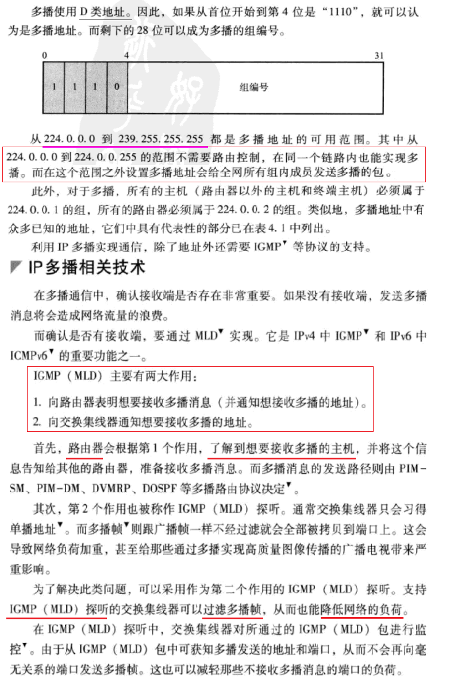
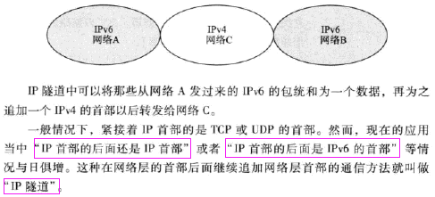
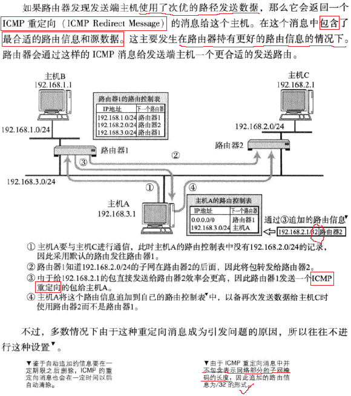
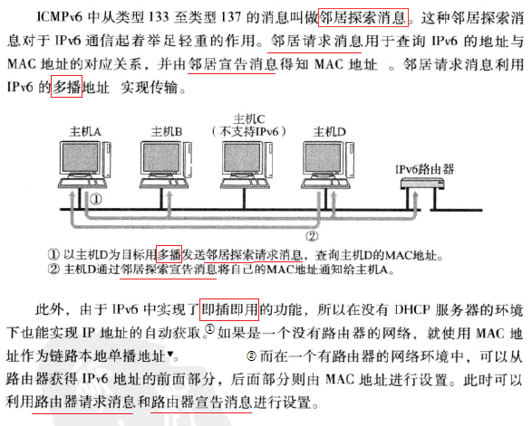

目录：

1. 网络层

 - IP多播
 - IP隧道 
 - IPv6的地址结构
 - 路径MTU发现
 - ICMP报文消息类型详解
 - ICMPv6的邻居探索

<!--more-->
#1. 网络层

## IP多播：

附：[既定已知的多播地址.png](../image/b3dcfa99-2.png)

## IP隧道

用处：

 - MobileIP
 - 多播包的转播（使用IP隧道，使路由器用单播的形式发包）
 - IPv4网络中传送IPv6的包 √
 - IPv6网络中传送IPv4的包 √
 - 将数据链路的PPP包用IP包转发时

## IPv6的地址结构

## 路径MTU发现

## ICMP报文消息类型详解
 - ICMP目标不可达消息（类型3）
	 - 错误代码1（主机不可达）：路由表中没有该主机信息，或该主机(关机)没有连接到网络
	 - 错误代码2（协议不可达）(Protocol Unreachable)
	 - 错误代码3（端口不可达）(Port Unreachable)
	 - 错误代码4（Fragmentation Needed and Don't Fragment was Set）：用于MTU探索

 - ICMP重定向消息（类型5）

 - ICMP超时消息（类型11）

	 当TTL==0时，IP路由器就会给发送端主机返回一个 ICMP超时消息。  
	应用：tracerouter。  

 - ICMP回送消息（类型0、8）

	用于进行通信的主机或路由器之间，判断所发送的数据包是否已经成功到达对端的一种消息。  
	应用：ping命令。

 - ICMP路由探索消息（类型9、10）

	主要用于发现与自己相连的网络中的路由器。当一台主机发出ICMP路由请求（Router Solicitaion，类型10）时，路由器则返回ICMP路由器通告消息（Router Advertisement，类型9）给主机。

 - ICMP地址掩码消息（类型17、18）
	
	主要用于主机或路由器想要了解子网掩码的情况。可以向那些目标主机或路由器发送ICMP地址掩码请求消息（ICMP Address Mask Request，类型17），然后通过接收ICMP地址掩码应答消息（ICMP Address Mask Reply，类型18）获取子网掩码的信息。

## ICMPv6的邻居探索

	
附：[ICMPv6常用的报文消息类型](../image/b3dcfa99-10.png)

-----
本文中提到的一些专有名词：

 - IGMP：Internet Group Management Protocol
 - MLD(Multicast Listener Discovery)：多播监听发现。
 - MSS：最大段长度
 - 链路本地单播地址：同一链路内唯一的地址。
 - AS(Autonomous System)：自治系统

---
本文为原创文章，包含脚本行为，会经常更新知识点以及修正一些错误，因此转载请保留原出处，方便溯源，避免陈旧错误知识的误导，同时有更好的阅读体验。  
本文地址：[http://nibnait.com/b3dcfa99-Computer-Networking-advanced/](http://nibnait.com/b3dcfa99-Computer-Networking-advanced/)