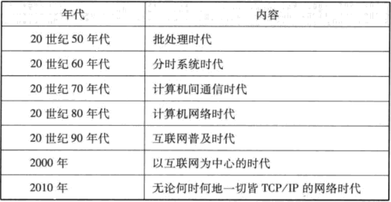
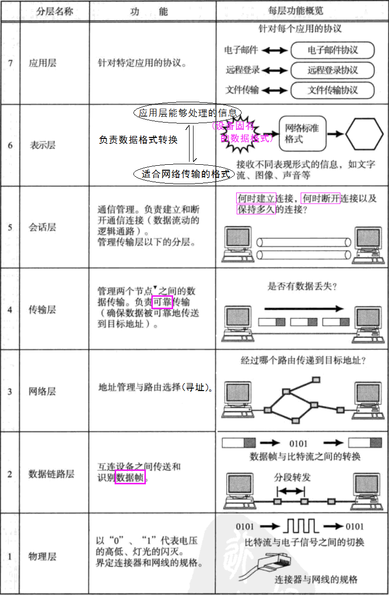

首先分享一段 [《互联网 发展 历史》 的8分钟小视频](http://v.youku.com/v_show/id_XNjU3MTE2MTY=.html) 

<!--more-->
<iframe height=498 width=510 src="http://player.youku.com/embed/XNjU3MTE2MTY=" frameborder=0 allowfullscreen></iframe>

概念：将一个个独立的计算机连接起来，即组成了计算机网络。  
再结合这张图，不难看出 计算机的发展史，也就是计算机网络的发展史

# 计算机网络的基础知识

在计算机网络发展的初期，各家计算机厂商都发明了一套自己的计算机通信协议，不同品牌的计算机无法进行通信，于是ISO▼制定了一个国际标准 OSI协议。  

OSI七层参考模型▼：  

## 搭建网络的主要设备

|设备|别名|作用|
|:---|:---|:---|
|网卡|NIC▼/网络适配器/LAN卡|使计算机连网|
|中继器(Repeater)|集线器(Hub)==多口中继器|在物理层，将减弱的信号放大并发送|
|网桥(Bridge)|2层交换机/以太网交换机/链路层交换机/交换集线器(具有网桥功能的Hub)|在数据链路层，校验并转发 数据帧 （将损坏的数据直接丢弃）（ 传送门：[各种校验-CRC▼](http://nibnait.com/d4c81fd3-error-detection-and-correction/)）|
|路由器(Router)|3层交换机|在网络层，通过IP协议根据IP地址对 数据报 进行转发|
|4~7层交换机| |· 负载均衡 · 防火墙(网关) · 带宽控制(优先处理一些及时性要求比较高的通信请求：语音通话) · 特殊应用访问加速、广域网加速器....
|网关(Gateway)||· 协议的转换(表示层)与数据的转发(4~7层)|
|应用网关|代理服务器|· 是网关的一种 · 可以从传输层到应用层对数据和访问进行各种控制和处理

##传输方式的分类
### 1. 面向有连接型与面向无连接型
 - 面向有连接型
	 - TCP
	 - 打电话建##立/断开连接的时候、
 - 面向无连接型
	 - UDP、IP
	 - 邮局寄包裹(不需要确认收件人的详细地址是否真实存在)、视频/语音通信的过程(没有必要保证每一帧都成功的传送到达目的地)、

### 2. 电路交换与分组交换
 - 电路交换

	 - 主要用于：过去的**电话网**。
	 - 两台主机通信时 是独占整个电路的。同一电路的其他多台计算机只能等待正在通信的计算机收发信息完毕以后 才有机会使用这条电路。

 - 分组交换

	 - 主要用于：**现代计算机网络**
	 - 处理过程：发送端计算机将数据分组发送给路由器，路由器收到这些分组数据以后，缓存到自己的缓冲区，然后再转发给目标计算机
	 - 限制：根据网络的拥堵情况，数据到达目标地址的时间有长有短。路由器的缓存饱和或溢出时，容易造成数据丢失。

### 3. 按接收端的数量分类

 - 单播(Unicast)
	 - 1v1通信，打电话。
 - 广播(Broadcast)：同一数据链路内的所有主机
	 - 电视频道、收音机频道。
 - 多播(Muticast)：与特定组内的计算机通信
	 - 电话/视频会议
	 - “1年1班的同学们，请起立！”
 - 任播(Anycast)：解析特定组内的任意一台计算机
	 - DNS根域名解析服务器(负载均衡)
	 - “1年1班的哪位同学上来领一下奖状？”
	 - “飞机上哪位乘客是医生？”

-----
本文中提到的一些专有名词：
 
 - ISO：国际标准化组织(International Organization for Standards)
 - OSI：开放式通信系统互联参考模型(Open System Interconnection)
 - NIC：网络接口卡(Network Interface Card)
 - CRC：循环冗余校验(Cyclic Redundancy Check)
 - WAN：广域网(Wide Area Netword)
 - LAN：局域网(Local Area Network)
 - Internet：网际网（WAN√、LAN√）
 - The Internet：互联网