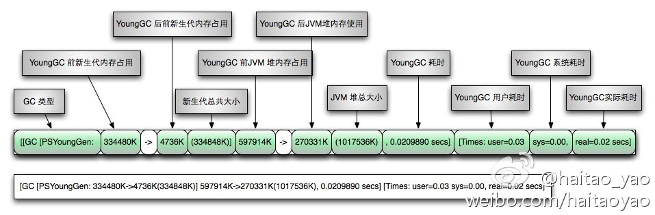
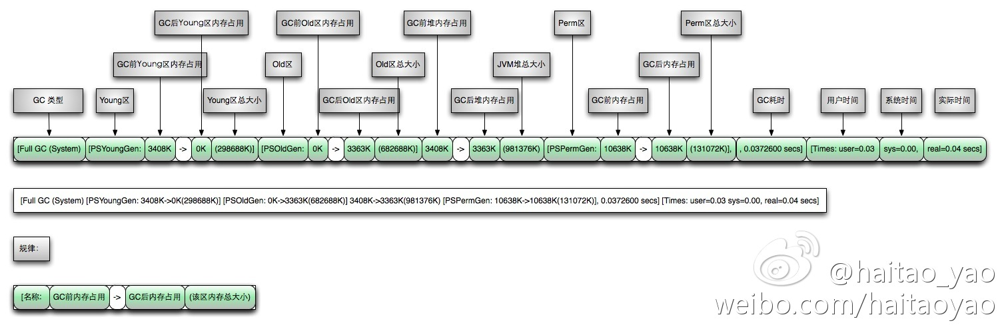

# 常用的Jvm启动参数
 - -Xmx512m：设置JVM最大可用内存为512M。
 - -Xms512m：设置JVM初始内存为512m。此值可以设置与-Xmx相同，以避免每次垃圾回收完成后JVM重新分配内存。<!--more-->
 - -Xmn200m：设置年轻代大小为200M。整个堆大小=年轻代大小 + 年老代大小 + 持久代大小。持久代一般固定大小为64m，所以增大年轻代后，将会减小年老代大小。此值对系统性能影响较大，Sun官方推荐配置为整个堆的3/8（young占30%左右）

 - -verbose:gc：开启gc日志
 - -Xloggc:gcc.log：将日志输出到文件xx(默认位置为桌面)
 - -XX:+PrintGCDetails：打印GC详情
 - -XX:+PrintGCDateStamps：打印GC时间戳 

## gc日志大致共性
YoungGC

FullGC

## gc 参数设置
各分区的大小对GC的性能影响很大。如何将各分区调整到合适的大小，分析活跃数据的大小是很好的切入点。

**活跃数据的大小**是指，应用程序稳定运行时长期存活对象在堆中占用的空间大小，也就是Full GC后堆中老年代占用空间的大小。可以通过GC日志中Full GC之后老年代数据大小得出，比较准确的方法是在程序稳定后，多次获取GC数据，通过取平均值的方式计算活跃数据的大小。活跃数据和各分区之间的比例关系如下

| 空间   | 倍数                                    |
| :----- | :-------------------------------------- |
| 总大小 | **3-4** 倍活跃数据的大小                |
| 新生代 | **1-1.5** 活跃数据的大小                |
| 老年代 | **2-3** 倍活跃数据的大小                |
| 永久代 | **1.2-1.5** 倍Full GC后的永久代空间占用 |

例如 根据GC日志获得老年代的活跃数据大小为300M，那么各分区大小可以设为：
> -Xmx 总大小：300 x 4 = 1200M  
> -Xmn 年轻代：300 x 1.5 = 450M  
> -Xms 初始值 = Xmx = 1200M（避免每次垃圾回收完成后JVM重新分配内存）  
> 老年代 = Xmx - Xmn = 750M  
> 持久代 一般默认 64M。JDK8之后 不再有持久代，元数据被放到本地内存中了，默认可以吃掉所有系统可用内存

参考：
[GC性能优化](https://blog.csdn.net/renfufei/column/info/14851)

# FGC实战

[美团 - 从实际案例聊聊Java应用的GC优化](https://tech.meituan.com/2017/12/29/jvm-optimize.html)

## 动态年龄计算

为什么设置了MaxTenuringThreshold=15，对象仍然仅经历2次Minor GC，就晋升到老年代？这里涉及到“动态年龄计算”的概念。

**动态年龄计算**：Hotspot遍历所有对象时，按照年龄从小到大对其所占用的大小进行累积，当累积的某个年龄大小超过了survivor区的一半时，取这个年龄和MaxTenuringThreshold中更小的一个值，作为新的晋升年龄阈值。在本案例中，调优前：Survivor区 = 64M，desired survivor = 32M，此时Survivor区中age<=2的对象累计大小为41M，41M大于32M，所以晋升年龄阈值被设置为2，下次Minor GC时将年龄超过2的对象被晋升到老年代。

JVM引入动态年龄计算，主要基于如下两点考虑：

1. 如果固定按照MaxTenuringThreshold设定的阈值作为晋升条件： a）MaxTenuringThreshold设置的过大，原本应该晋升的对象一直停留在Survivor区，直到Survivor区溢出，一旦溢出发生，Eden+Svuvivor中对象将不再依据年龄全部提升到老年代，这样对象老化的机制就失效了。 b）MaxTenuringThreshold设置的过小，“过早晋升”即对象不能在新生代充分被回收，大量短期对象被晋升到老年代，老年代空间迅速增长，引起频繁的Major GC。分代回收失去了意义，严重影响GC性能。
2. 相同应用在不同时间的表现不同：特殊任务的执行或者流量成分的变化，都会导致对象的生命周期分布发生波动，那么固定的阈值设定，因为无法动态适应变化，会造成和上面相同的问题。

总结来说，为了更好的适应不同程序的内存情况，虚拟机并不总是要求对象年龄必须达到Maxtenuringthreshhold再晋级老年代。

## 跨代引用问题

特别需要注意一点，**重新标记**阶段是以新生代中对象为根来判断对象是否存活的。

Remark阶段主要是通过扫描堆来判断对象是否存活。那么准确判断对象是否存活，需要扫描哪些对象？CMS对老年代做回收，Remark阶段仅扫描老年代是否可行？结论是不可行，原因如下：

如果仅扫描老年代中对象，即以老年代中对象为根，判断对象是否存在引用，上图中，对象A因为引用存在新生代中，它在Remark阶段就不会被修正标记为可达，GC时会被错误回收。 新生代对象持有老年代中对象的引用，这种情况称为**“跨代引用”**。因它的存在，Remark阶段必须扫描整个堆来判断对象是否存活，包括图中灰色的不可达对象。

灰色对象已经不可达，但仍然需要扫描的原因：**新生代GC和老年代的GC是各自分开独立进行的**，只有Minor GC时才会使用根搜索算法，标记新生代对象是否可达，也就是说虽然一些对象已经不可达，但在Minor GC发生前不会被标记为不可达，CMS也无法辨认哪些对象存活，只能全堆扫描（新生代+老年代）。由此可见堆中对象的数目影响了Remark阶段耗时。 分析GC日志可以得出同样的规律，Remark耗时>500ms时，新生代使用率都在75%以上。这样降低Remark阶段耗时问题转换成如何减少新生代对象数量。

新生代中对象的特点是“朝生夕灭”，这样如果Remark前执行一次Minor GC，大部分对象就会被回收。CMS就采用了这样的方式，在Remark前增加了一个可中断的并发预清理（CMS-concurrent-abortable-preclean），该阶段主要工作仍然是并发标记对象是否存活，只是这个过程可被中断。此阶段在Eden区使用超过2M时启动，当然2M是默认的阈值，可以通过参数修改。如果此阶段执行时等到了Minor GC，那么上述灰色对象将被回收，Reamark阶段需要扫描的对象就少了。

除此之外CMS为了避免这个阶段没有等到Minor GC而陷入无限等待，提供了参数CMSMaxAbortablePrecleanTime ，默认为5s，含义是如果可中断的预清理执行超过5s，不管发没发生Minor GC，都会中止此阶段，进入Remark。 根据GC日志红色标记2处显示，可中断的并发预清理执行了5.35s，超过了设置的5s被中断，期间没有等到Minor GC ，所以Remark时新生代中仍然有很多对象。

对于这种情况，CMS提供CMSScavengeBeforeRemark参数，用来保证Remark前强制进行一次Minor GC。

## 阅读一下GC日志

以JxlTest为例，通过gc日志，fix FGC问题。参考[阿飞的博客-FGC实战](https://mp.weixin.qq.com/s/0VeZYuoMG8PimeHk4CbjTQ)

