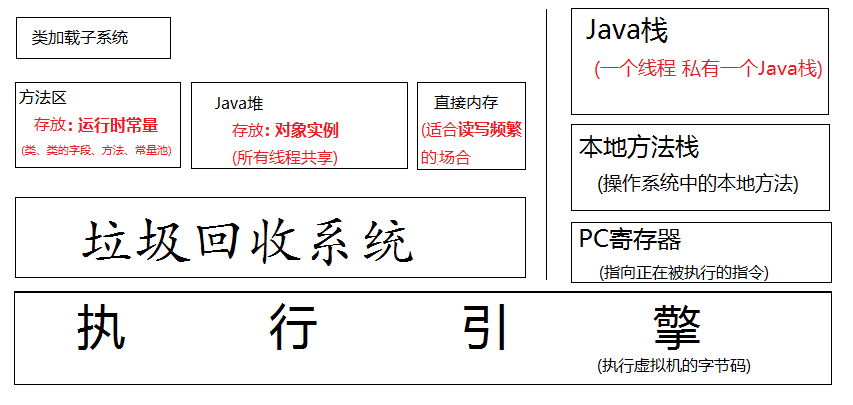
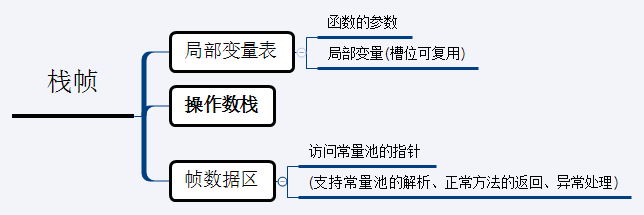
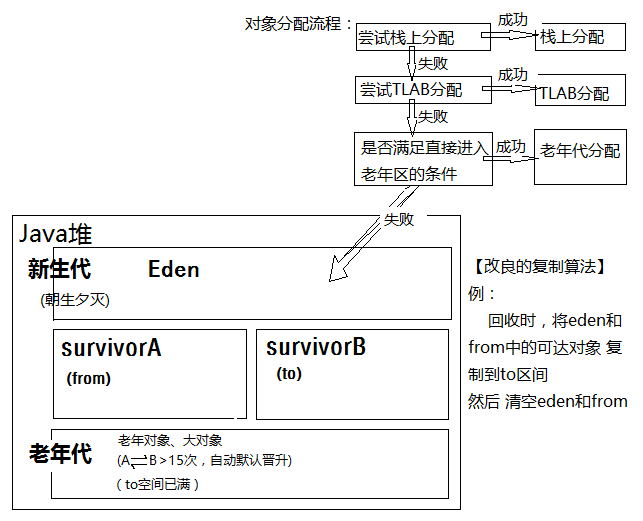
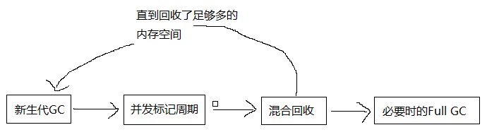
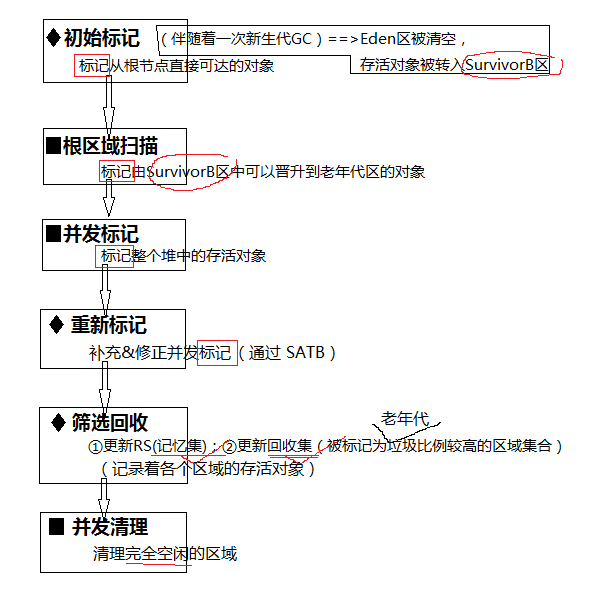
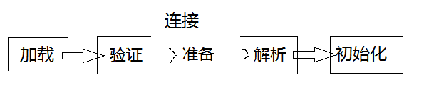

书单列表：  
 - [《深入理解Java虚拟机（第2版）》](https://book.douban.com/subject/24722612/)
 - [《实战Java虚拟机》](https://book.douban.com/subject/26354292/)

目录：
  
 - Java虚拟机的基本结构  
 - 常用的垃圾回收算法  <!--more-->
	1. 引用计数法
	2. 标记清除法
	3. 复制算法
	4. 标记压缩法
	5. 分代算法
	6. 分区算法  
 - 垃圾回收器  
	1. 串行回收器
	2. 并行回收器
	3. CMS回收器
	4. G1回收器  
 - Class装载系统  
	1. 类装载步骤
	2. 双亲委托模式
 - 字节码执行
	1. Class文件结构
	2. JIT


# Java虚拟机的基本结构


 - Java栈：由**栈帧**组成，一个函数对应一个栈帧(函数被调用-->入栈)，[栈顶---当前正在运行的函数]，[弹栈-->①函数正常return;②Exception]
 - 方法区：
	 - JDK1.6、1.7 ==> 又叫永久区(Perm)
	 - JDK1.8 ==> 叫元数据区(Metaspace)，(默认 可以吃掉所有系统可用内存)

# 常用的垃圾回收算法

“垃圾”：内存中，不会再被使用的对象。

## 1. 引用计数法

	==>缺点：①无法处理循环引用；②'+'、'-'计数器浪费性能

## 2. 标记清除法

 - 标记：标记从 *根节点* 开始的所有可达对象  
 - 清除：清除所有未被标记的对象

	==>缺点：回收后的空间不是连续的，在给大对象分配堆空间时 效率低。

## 3. 复制算法(适用于 存活对象少，垃圾对象比较多的新生代)

	例：将内存(Java堆)平均分为两块A、B，每次清理只需要将A中存活的对象复制到B中，然后清空A。  
	从而解决了 回收后空间不连续的问题


## 4. 标记压缩清除法(适用于老年代)

 - 标记 从 *根节点* 开始的所有可达对象
 - 压缩到内存的一端
 - 清除边界外的所有垃圾

## 5. 分代算法    
	
	即 新生代用“**改良的复制算法**”，老年代用“**标记压缩清除法**”
	


	 - 栈上分配：基于逃逸分析技术，将线程私有的*小对象*打散分配到Java栈上。（函数调用结束后，会自行销毁，不需要垃圾回收器介入从而提高了性能）
	 - 逃逸分析：对象的作用域未逃出函数体(-server模式下 默认开启)
	 - TLAB（Thread-local allocation buffer）：线程本地分配缓存(是一个线程专用的内存分配)。（实质：线程专属区间 ⊂ Eden区间）
	 - 在老年代引入**卡表**(比特位集合，每一位表示老年代的4k空间)，（1：有被新生代引用的对象，0：无,,,,,,）以应对新生代的高频率GC，每次只需扫描卡表中为1的空间即可。

## 6. 分区算法

	将整个堆划分成连续的不同的小区间，每个小区间独立使用，独立回收。  
	从而能够更好地控制一次GC产生的停顿时间

# 垃圾回收器

| 回收器        | 串行/并行   |    算法  |  特点  |
| :--------:   | :-----:  | :----:  | :----:  |
|新生代串行回收器|单线程|复制算法|实现简单 逻辑处理高效|
|老年代串行回收器|单线程|标记压缩清除|(堆空间较大时)停顿时间长|
|新生代ParNew回收器|多线程|复制算法|性能要看CPU的并发能力|
|新生代ParallelGC回收器|多线程|复制算法|[MaxGCPauseMillis]<br/>[GCTimeRatio]<br/> **关注吞吐量**|
|老年代ParallelGC回收器|多线程|标记压缩清除|**关注吞吐量**|

## 1. CMS回收器[**关注系统停顿时间**]

	（Concurrent Mark Sweep）并发标记清除
 - 初始标记：【STW】 标记根对象
 - 并发标记：标记所有可达对象
 - 预清理：正式清理前的准备和检查(并发)，尝试控制一次停顿时间
 - 重新标记：【STW】 修正*并发标记*
 - 并发清理：(并发)回收垃圾对象
 - 并发重置：重新初始化CMS数据结构和数据

## 2. G1回收器(Garbage First)


 - 新生代GC：回收处理Eden和SurvivorA区。==> 老年代的区域增多
 - 并发标记周期：

SATB(Snapshot-At-The-beginning)：在初始标记时为存活对象建立的快照
 - 混合回收
	 - 正常的年轻代GC(改良的复制算法)
	 - 优先清理回收集中垃圾比例较高的区域
 - 必要时的Full GC（回收时，内存不足的时候）
	 - 新生代GC时，survivor区和老年代区无法容纳幸存对象时
	 - 并发标记时，老年代被快速填充
	 - 混合GC时，发生空间不足

# Class装载系统
## 1. 类装载步骤

	 - 加载：解析类方法区内的数据结构 并创建实例
	 - 验证：class文件格式、语义检查、字节码验证、符号引用验证...
	 - 准备：为类在Java堆中分配空间，设置初始值
	 - 解析：将 类、接口、字段、方法的符号引用转为直接引用
	 - 初始化：编译器自动生成并执行类的初始化方法```<clinit>```（方法```<clinit>```由类静态成员的赋值语句和static语句块合并产生）


## 2. 双亲委托模式(系统默认使用)


在类加载的时候，
			

    if（当前类已经被加载）{  
        return 当前可用类;  
    } else {  
        请求其双亲加载器加载此类；  
        if（success）{  
            return 可用的类；  
        } else{  
            自己加载；  
            return 类；  
        }  
    }  


## 字节码执行

