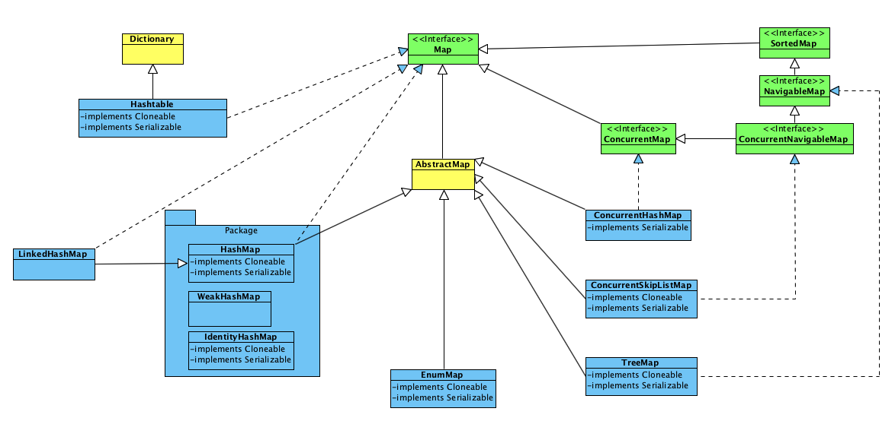

Map、List、Set

<!--more-->

# 接口继承关系


# Map


## HashMap
是根据key的hashCode来存储数据，因此get和put的时间复杂度为O(1)，但遍历的顺序是不确定的。  
key和value都允许为null，  
HashMap的非线程安全的，多个线程可以同时操作一个HashMap，因此会出现数据不一致的场景。
可以使用Collections.synchronizedMap方法使HashMap具有线程安全的能力，或者直接使用ConcurrentHashMap。

```
 Map m = Collections.synchronizedMap(new HashMap());
      ...
  Set s = m.keySet();  // Needn't be in synchronized block
      ...
  synchronized(m) {  // Synchronizing on m, not s!
      Iterator i = s.iterator(); // Must be in synchronized block
      while (i.hasNext())
          foo(i.next());
  }
```
### 影响HashMap性能的两个重要参数：

 - capacity（初始容量为16）当前数组的容量。当容量达到负载因子的阈值时，会扩容为当前容量的2倍。
 - loadFactor（默认0.75）
数组的Entry包含四个属性：key, value, hashCode, next。

1.7及以前采用的是数组+链表的设计。
1.8以后，当Entry的链表元素超过8个时，会将链表转换为红黑树。

### HashMap可能引起的3个线程不安全的问题：

1. put非空元素，get的确是空
2. 链表死循环（1.7之前，头插法）
3. 数据丢失

## ConcurrentHashMap
整个 ConcurrentHashMap 由一个 Segment 数组组成，Segment 通过继承 ReentrantLock 来进行加锁，所以每次需要加锁的操作锁住的是一个 segment，这样只要保证每个 Segment 是线程安全的，也就实现了全局的线程安全。  
每个segement内部实现与HashMap类似，ConcurrentHashMap的concurrencyLevel（默认16），即理论上最多可以支持16个线程同时操作这个ConcurrentHashMap。  
concurrencyLevel可以在初始化时设置为其他值`ConcurrentHashMap concurrentHashMap = new ConcurrentHashMap(ConcurrentHashMap.DEFAULT_INITIAL_CAPACITY, ConcurrentHashMap.DEFAULT_LOAD_FACTOR, 20);`，但是一旦初始化之后就不可以更改了

put 操作： key和value都不允许为空

        segmentShift = 32 - sshift;     //32 - 4 = 28（2 ^ sshift = concurrencyLevel）
        segmentMask = concurrencyLevel - 1;        //16 - 1 = 15
        //先找到segment段的hash
        segmentHash = (hash >>> segmentShift) & segmentMask
        //HashMap.put(key, hash, value)

### concurrentHashMap 的size方法，用到锁了吗？

**JDK1.6** size()、isEmpty()、containsValue() 的套路是一样的：先不加锁统计sum += segment[i].count和mcsum += mc[i] = segment[i].modCount（段只要改变了modCount++），然后二次统计 check += segment.count，同时如果mc[i] != segment[i].modCount，说明二次统计过程中，此段发生过改变。

则强制check = -1，进行第二轮不加锁统计count。二次统计之后，如果check = sum，则返回sum，否则强制给16个段加锁，统计sum，然后再给16个段解锁。

**JDK1.8** 是没有加锁的，他是直接统计每一个段的baseCounter，因为baseCounter采用的是CAS方法，同一时刻同一segment只会有一个线程更新成功。

## Hashtable

Hashtable是一个遗留类，它内部实现与HashMap类似。
区别是：1. Hashtable的key和value都不允许为null。2. Hashtable的每一个方法都由synchronized修饰，即Hashtable是线程安全的（同一时刻只允许一个线程操作Hashtable）
因此Hashtable的并发性没有ConcurrentHashMap。
所以在代码中很少使用，并发场景使用ConcurrentHashMap，不需要线程安全的场景一般使用HashMap。

## LinkedHashMap
LinkedHashMap 是 HashMap 的一个子类，它将key的hash数组改成了一个双向链表从而实现了可以记录每一个元素的插入顺序。使用Iterator遍历时，会安装插入顺序返回每个元素。  
也可以在在初始化时带参数`LinkedHashMap linkedHashMap = new LinkedHashMap(16,  0.75f, true);` 使迭代时按访问顺序迭代（LRU）。

## TreeMap
TreeMap 实现了 SortedMap接口，默认根据键值的升序排序。也可以在初始化时通过指定Comparator，来指定排序顺序：
```
        TreeMap<Integer, Integer> treeMap = new TreeMap(new Comparator<Integer>() {
            public int compare(Integer o1, Integer o2) {
                return o1-o2;
            }
        });
```
适合非多线程情况加的有序Map场景。并发度较低的时，可以使用Collections.synchronizedSortedMap进行包装，也能提供较好的效率。

## ConcurrentSkipListMap
JDK1.6之后引入的ConcurrentSkipListMap。它是将元素的Key基于SkipList的方式进行排序。因此get/put/remove/constainsKey等操作的时间复杂度为O(logN)。  
不允许key value为空。  
没有size变量，因此在调用size()方法时，会遍历整个SkipList，时间复杂度O(N)。  

因此 ConcurrentSkipListMap 适合处理高并发也需要对Map键值进行排序的场景。

# List


## ArrayList
ArrayList是一个可变长数组，初始化capacity = 10。
扩容策略：
JDK1.6：`newCapacity = (oldCapacity * 3)/2 + 1`          // old * 1.5 + 1  
JDK1.7+：`newCapacity = oldCapacity + (oldCapacity >> 1)` // old * 1.5  
每一次扩容 都要将旧数组拷贝到新数组中。(System.arraycopy)

当想要在中间位置插入/删除元素时，都会需要将index后面的数据往前移动一位（ArrayList的每个元素之间不允许有间隔）。代价较高，因此ArrayList仅适合按下标随机查找和遍历，不适合插入和删除。

## Vector
Vector与ArrayList一样，也是一个可变长数组。Vector是线程安全的，类似于Hashtable，同一时刻只允许有一个线程操作它（内部方法被synchronized修饰了）。

## LinkedList
LinkedList是一个链表，提供了一些可以直接操作表头和表尾元素的方法，因此可以用来当做栈、队列、双向队列来使用。  
push() == addFirst()

## CopyOnWriteArrayList
CopyOnWrite，在写的时候会把数据复制一份出来，供其他线程来读。适用于写操作比较少，且能够容忍短暂的读写不一致的高并发场景。

# Set


## HashSet
HashSet的内部是一个HashMap，add操作时，直接调用的`map.put(e, PRESENT)`方法。即如果元素不存在 则直接将其添加进map中，如果元素已存在则return false;

## TreeSet
TreeSet的内部是一个TreeMap，它继承了SortedMap，因此在迭代TreeSet时，出来的元素默认是按升序排好序的。  
Integer和String对象可以进行默认的TreeSet排序，如果是自定义的对象，**则必须实现Comparable接口，并覆盖CompareTo()函数**，才可以正常使用。

## ConcurrentSkipListSet
ConcurrentSkipListSet内部基于ConcurrentSkipListSet，因此它适合高并发环境下的有序集合。

## LinkedHashSet
LinkedHashSet继承自HashSet，但是他是基于LinkedHashMap实现的。因为HashSet为LinkedHashMap专门写了一个 初始化LinkedHashMap的方法。  
但LinkedHashSet的迭代时，只能按照插入顺序迭代。

## CopyOnWriteArraySet
CopyOnWriteArraySet内部基于CopyOnWriteArrayList实现的。只是CopyOnWriteArraySet内部的元素是不重复的。  
它同样是线程安全的，适用于写操作比较少，且能够容忍短暂的读写不一致的高并发场景。

---
JDK源码学习：
JDK 1.6：[https://github.com/nibnait/JDK_6](https://github.com/nibnait/JDK_6)  
JDK 1.7：[https://github.com/nibnait/JDK_7](https://github.com/nibnait/JDK_7)  
JDK 1.8：[https://github.com/nibnait/algorithms/blob/master/src/main/java/jdk](https://github.com/nibnait/algorithms/blob/master/src/main/java/jdk)