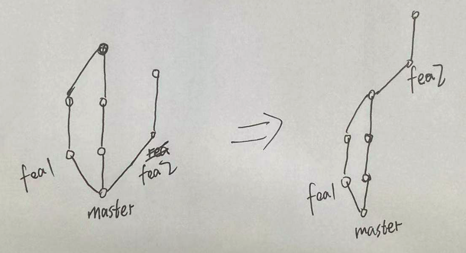

参考资料：http://jartto.wang/2018/12/11/git-rebase/

# Git rebase 变基

> gcam 'update'

> git log --oneline

```
b8bf2e1 (HEAD -> master) update
fa58af6 (origin/master) 探索字节跳动 - 挑战字符串
831441f 清空commit历史
```

> git rebase -i HEAD~2

```
pick fa58af6 探索字节跳动 - 挑战字符串	 //pick: 使用本次提交
s b8bf2e1 update										//squash：将本提交合并到pick出来的提交上
```

> :wq

删掉多余的commit信息

> :wq

> gp -f


# 分支合并-变基

> gco release/test

> git rebase master

这一步的目的：



解决好冲突之后：

> git add -A
>
> git rebase --continue


# 注意：

- 当与别人协作开发一个feature分支时，不要使用变基操作。你本地好了，人家本地没有进行变基，他在提交时会造成提交记录丢失

- 当要启动一个落后很久的feature分支时，就不要变基了，冲突太多了。

# 移除某个commit

```css
1.git log获取commit信息 
2.git rebase -i (commit-id) 
commit-id 为要删除的commit的下一个commit号 
3.编辑文件，将要删除的commit之前的单词改为drop 
4.保存文件退出大功告成 
5.git log查看
```