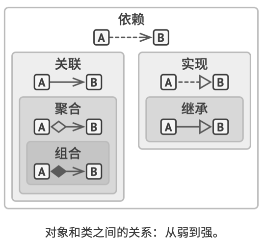

# 统一建模语言（Unified Modeling Language）

参考资料：
 - [UML概述 w3cschool](https://www.w3cschool.cn/uml_tutorial/uml_tutorial-c1gf28pd.html)
 - [PlantUML 简介](https://plantuml.com/zh/)

官方文档： 
 - [类图](https://plantuml.com/zh/class-diagram)
 - [时序图](https://plantuml.com/zh/sequence-diagram)
 - [颜色](https://plantuml.com/zh/skinparam#5d50889672f6f860)
 - [HTML Color Names](https://www.w3schools.com/colors/colors_names.asp)

## 对象之间的关系

 - 依赖：对类 B 进行修改会影响到类 A 。  
 （教授 --> 课程）
 - 关联：对象 A 知道对象 B。 类 A 依赖于类 B。  
 （教授 —> 学生）
 - 聚合：对象 A 知道对象 B 且由 B 构成。 类 A 依赖于类 B。  
 （大学 ◇—> 教授）
 - 组合：对象 A 知道对象 B、由 B 构成而且管理着 B 的生命周 期。 类 A 依赖于类 B。  
 （大学 ◆—> 学院）
 - 实现：类 A 定义的方法由接口 B 声明。 对象 A 可被视为对象 B。 类 A 依赖于类 B。  
 （审核通过/特批通过/审核拒绝 --▷ 审核）
 - 继承：类 A 继承类 B 的接口和实现， 但是可以对其进行扩 展。 对象 A 可被视为对象 B。 类 A 依赖于类 B。  
 （现货商品入参校验/预售商品入参校验 —▷ 商品入参校验）
 
组合是代替继承的一种方法。 继承代表类之间的“是”关系 （汽车是交通工具）， 而组合则代表“有”关系（汽车有一个 引擎）。