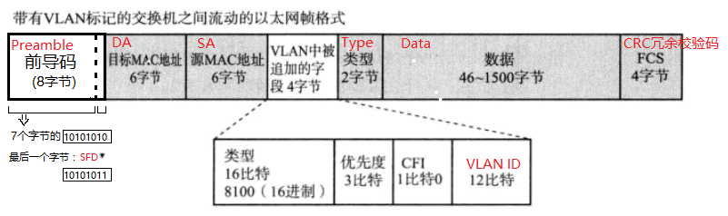
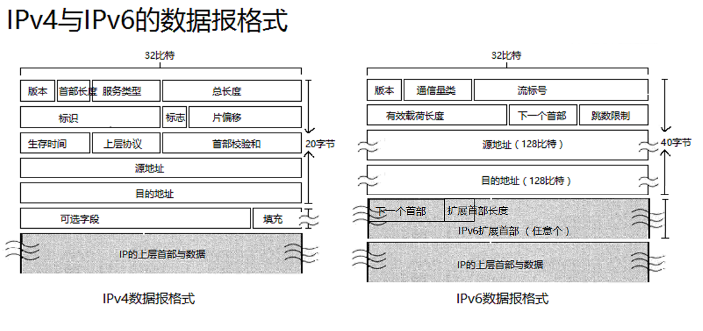

书单列表：

 - [《图解TCP/IP(第5版)》](https://book.douban.com/subject/24737674/)
 - [《计算机网络：自顶向下方法(原书第6版)》](https://book.douban.com/subject/26176870/)

<!--more-->

目录：

1. 数据链路层  
	 - 共享介质型网络
	 - 非共享介质型网络
	 - 以太网
		 - VLAN
		 - PPP协议
2. 网络层
	 - IPv4编址
	 - NAT技术
	 - IPv6与IPv4数据报格式对比
	 - IP报文的分片与重组
	 - IP协议相关技术
	 	- ARP
	 	- RARP
	 	- ICMP
	 	- ICMPv6
	 	- DHCP
	 - 路由选择算法
		 - 距离向量算法 - RIP、RIP2
		 - 链路状态算法 - OSPF
		 - BGP - 路径向量型协议

3. 传输层
	 - UDP - 用户数据报协议
	 - TCP - 传输控制协议
	 - 其他传输层协议

4. 应用层
	 - 远程登录 -- TELNET、SSH
	 - 文件传输 -- FTP
	 - 电子邮件 -- MIME、SMTP、POP、IMAP
	 - WWW -- HTTP
	 - 网络管理 -- SNMP、MIB、RMON

## TCP/IP的诞生：  

20世纪90年代，ISO展开了OSI这一国际标准协议的标准化进程。然而，OSI协议并没有得到普及，真正被广泛使用的是TCP/IP协议。究其原因，是因为[TCP/IP的标准化过程](http://nibnait.com/c09ed94b-TCP-IP-standardization-process/)是一个极其**注重实用性**的一个流程。

## TCP/IP与OSI参考模型

# 数据链路层
在LAN内，校验并转发 数据帧(根据MAC地址▼)

## 共享介质型网络
>	多个设备共享同一个载波信道进行发送和接收数据帧，半双工通信▼。

 - 争用方式：CSMA/CD▼
	 - 发前先听
	 - 边发边听
	 - 冲突即停
	 - 延时重发（指数退避等待）

 - 令牌传递方式：

	 提高网络性能的两种方法：令牌释放(不等待接收方的数据到达确认就将令牌发送给下一站)、令牌追加(多个令牌同时循环)

## 非共享介质型网络
>	不共享介质。网络中的每个站直连交换机，由交换机负责转发数据帧。由于发送端和接收端并不共享通信介质，所以这种通信方式是全双工的。

 - 以太网交换机(网桥)：**转发表**自学原理：
	 - 学习源地址
	 - 转发同网帧
	 - 丢弃异网帧
	 - 广播未知帧

 - 环路检测技术：
	 - 生成树协议(STP▼)：通过检查网络的结构 以某一个网桥为构造**树根**，并对每个端口配置**权重**，来指定优先使用哪些端口以及发生问题时该使用哪些端口。

## 以太网——有线局域网技术
历史：共享介质型网络-->非共享介质型网络

 - 以太网帧格式：

 - VLAN(virtual LAN，虚拟局域网)

>在链路层交换机(网桥)上，使用软件将一些端口逻辑地划分成的一个个网段。

 - 可以跨越不同子网、不同类型网络(以太网、FDDI▼、ATM▼等)从而**简化网络管理，减少设备投资**。
 - 交换机根据VLAN ID， 可以过滤多余的包，从而达到**控制流量 减少了网络负载** 并 **提高了网络的安全性**。 

## PPP(Point-to-Point Protocol):
>	拨号上网时，一个将IP数据报**封装**到串行链路的**方法**。

主要功能：

	 -  LCP(链路控制协议)：负责建立、(加密拨号登陆)配置和测试数据链路连接
	 -  NCP(网络控制协议)：负责设置IP地址(IPCP)、连接上一层

# 网络层

## IP协议：尽力而为(面向无连接的)

一些特殊的IP地址：

|网络号|主机号|10进制表示|源地址|目的地址|含义|
|:---:|:---:|---|:---:|:---:|---|
|0|0|0.0.0.0|✔️|❌|本网络上的本主机|
|0|host-id||✔️|❌|本网络上的某台host-id任播|
|全1|全1|255.255.255.255|❌|✔️|本网络上的广播,不能被路由器转发|
|net-id|全1||❌|✔️|指定net-id上的所有主机广播|
|127|任何数 (但不能都是0或1)|127.×××.×××.××× （默认：127.0.0.1=localhost）|✔️|✔️|本地回环测试地址|

## NAT▼技术：极大的缓解了IPv4地址不够用的囧境
>在本地网络中使用私有地址，在连接互联网时转而使用全局IP地址的技术。

 - 潜在问题：①无法从NAT外部向内部服务器建立连接；②转换表的生成与转换操作都会产生一定的开销。

 - 解决地址短缺的最佳途径还是：普及IPv6。

## IPv6

附：[IPv4与IPv6数据报格式详解.png](../image/58316970-ipv4-ipv6.png)

## IP报文的分片与重组

> - IPv4:在路由器上分片，在接收端主机上重组。
- IPv6:在发送端主机上分配，接收端主机重组。最小的MTU==1280字节

1. 通过“路径MTU发现▼”，以确定分片时最大的MTU的大小。
	 - 主要利用一个ICMP不可达消息 将数据链路上MTU的值返回给发送机

## ARP▼

>	发送端主机根据IP地址，广播寻找其对应的MAC地址，（只适用于IPv4，IPv6中则可以用ICMPv6替代ARP发送邻居探索消息）实现链路内的IP通信。

附：[ARP包格式.png](../image/58316970-9.png)

 - ARP缓存表  
	通常发送端和接受端会把自己接收到的 带有IP地址和MAC地址的ARP响应包/ARP请求包中的信息缓存20分钟。以防止ARP包在网络中被大量广播，造成网络拥塞。
 - tips：虽然IP地址直到到达目标主机时都没有发生变化，但是数据链路的目标地址(MAC地址)却根据每个链路的不同而发生着变化。
 - MAC地址和IP地址缺一不可
	 - 在以太网上发送IP包时，“下次要经过哪个路由器发送数据报”中的“下一个路由器”就是其相应的MAC地址。
	 - 而如果没有IP地址，各个主机通信全靠广播MAC地址，那对于网桥来说将是一场灾难。

## RARP
>	将ARP反过来，从MAC地址定位IP地址。用于将打印机服务器等小型嵌入式设备接入到网络时。

## 辅助IP的ICMP▼
>	用于IP通信过程中，确认网络是否正常工作，以及遇到异常时进行问题的诊断。

附：[《计算机网络-进阶》--ICMP报文消息类型详解](http://tianbin.leanote.com/post/%E8%AE%A1%E7%AE%97%E6%9C%BA%E7%BD%91%E7%BB%9C-%E8%BF%9B%E9%98%B6)

## ICMPv6

附：[《计算机网络-进阶》--ICMPv6的邻居探索](http://tianbin.leanote.com/post/%E8%AE%A1%E7%AE%97%E6%9C%BA%E7%BD%91%E7%BB%9C-%E8%BF%9B%E9%98%B6)

## DHCP

 - 在使用DHCP之前，需先将DHCP所要分配的IP地址池、相应的子网掩码，默认路由控制信息，DNS服务器地址设置到服务器上。

	

 - DHCP中继代理

	使用DHCP中继代理之后，对不同网段的IP地址的分配也可以由一个DHCP服务器统一进行管理和维护。

	

## 路由选择算法

### 距离向量算法(Distance-Vector)
>	根据网络中的距离(跳数)和方向两种信息生成路由控制表。

 - RIP▼

	 - 选择经过路由器个数最少的路径
	 - 每隔30秒与其他相邻的路由器交换自己的路由表
	 - 直接相连的网络距离为0。距离的最大值为16，防止发生“无限计数”问题。
	 - 缺点：
	 	- 网络的个数越多，每次所要交换的路由控制信息就越大。
	 	- 在网络比较稳定时，还要定期交换信息，浪费贷款。
	 	- 由于每个路由器掌握的信息都不同，其正确性很难保证。
	 	- 无法实现可变长度子网构造的网络路由控制（路由器未交换子网掩码）。

 - RIP2  
	与RIP第一版的工作机制基本相同，增加了一些新的特点：
			

### 链路状态算法(Link-State)
>	在了解网络整个链接状态的基础上，所有路由器都持有相同的路由控制表。

 - OSPF▼
	 - 选择总的代价较小的路径。
	 - 允许多条费用相同的路径(而RIP仅一条路径)
	 - 对每条链路，对不同的TOS(服务类型)，设置多种费用测度
	 - 在大规模网络中，用层次的OSPF

	附：[OSPF的工作机制.png](../image/58316970-18.png)
	
	 - 层次OSPF

### BGP▼ - 路径向量型协议
>	边界网关协议是连接不同组织机构(不同自治系统)的一种协议。主要用于ISP之间的相互连接。

 - 根据所要经过的**AS路径信息访问列表**▼进行路由控制。
 - AS路径信息访问列表(AS Path List)：包含转发方向、距离以及途径所有AS的编号。

# 传输层
>	网络层的IP协议相当于邮递员，把IP数据包送到指定IP的目标主机上，  
>	传输层的TCP/UDP则负责 根据包裹信息（应用程序、端口号），判断信息的最终接收人（哪一个应用程序）。

## UDP——用户数据报协议
>   不提供复杂的控制机制，利用IP提供面向无连接的通信服务。并且它是将应用程序发来的数据在收到的那一刻，立刻按照原样发送到网上的一种机制。 

即使出现网络拥堵，UDP也无法进行流量控制等避免网络拥堵的行为。此外，传输途中即使出现丢包，UDP也不负责重发。甚至当出现包的到达顺序乱掉时也没有纠正的功能。如果需要这些细节控制，那么不得不交由采用UDP的应用程序去处理。UDP有点类似于用户说什么听什么的机制，但是需要用户充分考虑好上层协议类型并制作相应的应用程序。因此，也可以说，UDP按照“制作程序的那些用户的指示行事”。

由于UDP面向无连接，它可以随时发送数据。再加上UDP本身处理既简单又高效，因此经常用于以下几个方面：

 - 包总量少的通信（DNS、SNMP等）
 - 视频、音频等多媒体通信（即时通信）
 - 限定于LAN等特定网络中的应用通信
 - 广播通信（广播、多播）

首部格式：  

附：[UDP数据报首部“校验和”字段详解.png](../image/58316970-UDP.png)

## TCP——传输控制协议
目的：通过IP数据报实现可靠性传输

特点：

 - 丢包时的**重发控制**
 - 对次序乱掉的分包进行**顺序控制**
 - **面向有连接的协议**，只有在确认对端存在时才会发送数据，从而可以**控制通信流量**的浪费
 - 使用序列号和确认应答号实现顺序控制、窗口控制与重发控制。
 - 使用窗口大小来实现对TCP的**流**量大小的**控制** 和 **拥塞控制**

首部格式：  

附：[TCP数据报首部格式各字段详解.png](../image/58316970-TCP.png)

### TCP连接的建立与终止：  
(传说中的三次握手与四次挥手)  

1. 在数据通信之前，主机A通过TCP首部发送一个SYN包作为建立连接的请求（ACK=0,SYN=1，声明一个起始序号seq=x）等待确认应答
2. 主机B收到A要建立连接的请求，返回一个允许连接的SYNACK报文段（ACK=1,SYN=1，主机B的起始序号seq=y，确认应答号ack=x+1）
3. 为防止“已失效的连接请求报文段▼”突然又传回B，主机A再进行一次确认（ACK=1,SYN=0，主机A的起始序列号seq=x+1，确认应答号ack=y+1）
4. 数据传输结束之后，主机A可以发送一个TCP首部（FIN=1，主机A的起始序列号seq=u），请求断开连接。
5. 主机B收到“A不再发送数据的消息”后，返回一个确认报文（ACK=1,seq=v，ack=u+1）  
A收到B的确认后，进入等待状态，等待B请求释放连接。
6. B数据发送完成之后，向A请求断开连接（FIN=1,ACK=1,seq=w，ack=u+1）  
7. A收到B的断开请求后，回复一个确认信息，并进入TIME_WAIT状态▼，等待2MSL时间。

 - 虽然三次握手方式管理TCP连接可以更好地避免无连接，但这种协议为DOS攻击▼（更确切的说是SYN洪泛攻击▼）提供了可乘之机。

### 使用序列号和确认应答号实现顺序控制、窗口控制与重发控制

## 其他传输层协议

 - UDP-Lite（Lightweight User Datagram Protocol，轻量级用户数据报协议）
 - SCTP（Stream Control Transmission Protocol，流控制传输协议）
 - DCCP（Datagram Congestion Control Protocol，数据报拥塞控制协议）

附：[已经步入实用阶段的几个传输层协议详解.png](../image/58316970-25.png)

# 应用层

。。。写不动了

附：[几道常考的计算题.pptx](../ppt/58316970-%E8%AE%A1%E7%AE%97%E9%A2%98.pptx)

-----
本文中提到的一些专有名词：

 - MAC地址(Media Access Control Address)：介质访问控制地址。系统在网络上的唯一硬件编号，每个网卡都需要有一个唯一的MAC地址。
 - CSMA/CD(Carrier Sense Mutiple Access/Collision Detection)：具有碰撞检测的载波侦听多路访问
 - 半双工：只发送或只接受的通信方式。比如：无线电收发器，若两端同时说话，是听不见对方说的话的。
 - 全双工：发送数据的同时也可以接收数据。比如：打电话。
 - STP：Spanning Tree Protocol
 - SFD：Start Frame Delimiter
 - FDDI(Fiber Distribute Data Interface)：[分布式光纤数据接口。](http://baike.baidu.com/view/876931.htm)
 - ATM(Asynchronous Transfer Mode)：一种以信元为单位的异步传输模式。
 - 网络收敛：网络拥堵时，路由器或交换机发生丢包的现象。
 - PPPoE(PPP over Ethernet)：利用PPP的验证功能使各家ISP▼有效地管理终端用户的使用，实现按时计费。
 - ISP:Internet Service Provider 
 - NAT：Network Address Translator
 - Path MTU Discovery：发现路径中存在的所有数据链路中最小的MTU▼
 - MTU：Maximum Transmission Unit。参见[《计算机网络-进阶》--路径MTU发现](http://tianbin.leanote.com/post/%E8%AE%A1%E7%AE%97%E6%9C%BA%E7%BD%91%E7%BB%9C-%E8%BF%9B%E9%98%B6)
 - ARP(Address Resolution Protocol)：地址解析协议
 - RARP：Reverse Address Resolution Protocol
 - ICMP：Internet Control Managemet Protocol
 - DHCP：Dynamic Host Configuration Protocol 
 - RIP：Routing Information Protocol
 - OSPF：Open Shortest Path First
 - BGP(Border Gateway Protocol)：边界网关协议
 - 已失效的连接请求报文段：
	
 - DOS攻击：deny of service
 - SYN洪泛攻击:攻击者发送大量的TCP SYN报文段，而有意不进行第三次握手的步骤，直至服务器消耗完为第一次握手连接保留的有限资源。
 - TIME_WAIT状态： 在TIME_WAIT状态中，如果TCP client端最后一次发送的ACK丢失了，它将重新发送。TIME_WAIT状态中所需要的时间是依赖于实现方法的。典型的值为30秒、1分钟和2分钟。等待之后连接正式关闭，并且所有的资源(包括端口号)都被释放。
 - 2MSL(Maximum Segment Lifetime,最大报文生存时间)：虽然按道理，四个报文都发送完毕，我们可以直接进入CLOSE状态了，但是我们必须假想网络是不可靠的，有可能最后一个ACK丢失。所以TIME_WAIT状态就是用来重发可能丢失的ACK报文。

